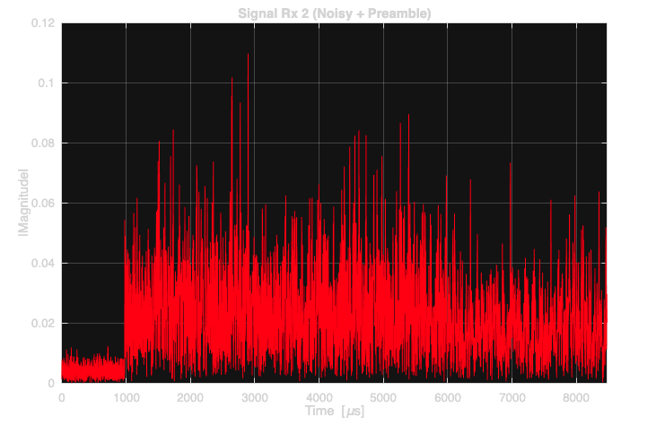
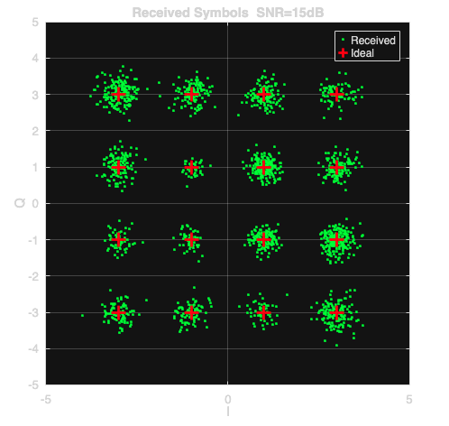

# MIMO-OFDM Baseband Transceiver Simulation 

## Overview
This repository contains a complete, end-to-end Baseband/Physical Layer (PHY) simulation of a **2x2 MIMO OFDM** communication system written in MATLAB. 

The script avoids high-level "black-box" toolbox functions where possible, implementing core DSP algorithms (like FFT shifting, interpolation, and scrambling) manually to demonstrate a deep understanding of the underlying mathematics.

## System Architecture & Features
* **Modulation:** 16-QAM payload data with BPSK system information multiplexing.
* **OFDM Architecture:** Configurable FFT size (512), cyclic prefix (1/4), and polyphase oversampling (x4).
* **MIMO Processing:** 2x2 Spatial Multiplexing with **V-BLAST** channel equalization at the receiver.
* **Synchronization:** Time-domain cross-correlation for frame start detection and Carrier Frequency Offset (CFO) estimation/correction.
* **Channel Impairments:** AWGN addition and synthetic Carrier Frequency Offset simulation.
* **Data Scrambling:** LFSR-based bit scrambling/descrambling for spectrum whitening.

## How to Run
1. Ensure you have MATLAB installed. No specialized communications toolboxes are strictly required due to the manual implementation of core DSP blocks.
2. The script reads input data from a local `text.txt` file. Make sure this file is present in the same directory.
3. Run `mimo_ofdm_tx_rx.m`.
4. The script will output the BER (Bit Error Rate) status in the console and generate 11 detailed figures showing time-domain signals, frequency spectrums, and IQ constellations before and after equalization.

## Example Output Visualizations

The script generates comprehensive visual diagnostics of the DSP chain. Below are examples of the received signal and the successfully equalized 16-QAM constellation.

### Baseband Spectrum (Rx Antenna 1)
   
*Received OFDM signal with AWGN.*

### Equalized Spatial Multiplexing Constellation
   
*Recovered 16-QAM symbols after V-BLAST equalization and CFO correction at SNR = 15dB.*
